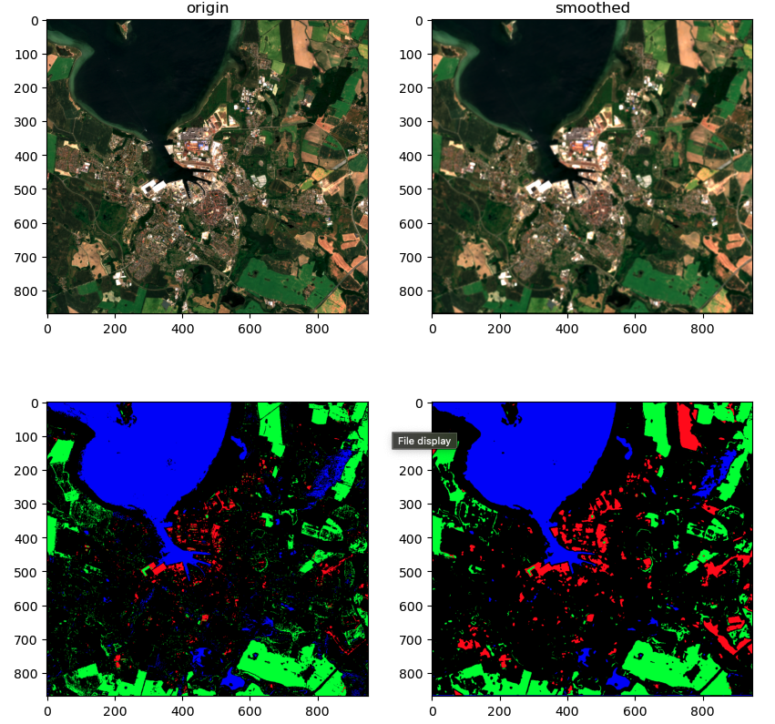

<h2 align="center">
  <a href="https://moseskonto.tu-berlin.de/moses/modultransfersystem/bolognamodule/beschreibung/anzeigen.html?nummer=40937&version=3&sprache=2" target="_blank">SoSe2024: Image Processing for Remote Sensing</a> 
  TU Berlin, Computer Engineering MSc.
</h2>

  

### Content 😈
1.	Basics of Remote Sensing: Introduction to key concepts in remote sensing, including working with Sentinel-2 data for visualization and analysis.
2.	Image Enhancement and Filtering: Understanding image enhancement techniques and applying 2D convolution operations for image filtering. It also covers image histograms for better image interpretation.
3.	Edge Detection and Classification: Learning edge detection methods and techniques for RS image classification, especially for generating land-cover maps.
4.	Vegetation Indices and Hyperspectral Pixel Classification: Exploring the use of vegetation indices and hyperspectral pixel classification for remote sensing analysis.
5.	Convolutional Neural Networks (CNNs) for RS: A deep dive into CNNs and their applications in image classification and hyperspectral image analysis.
6.	Deep Representation Learning: Studying how deep representation learning techniques can be applied for RS image retrieval.
7.	Hyperspectral Image Processing: Focusing on the analysis and processing of hyperspectral images through multiple related experiments.

### Lab & Homework ✍️
1. Visualize tiles and create pixel-wise classification map.
2. Use a ResNet18 architecture for supervised scene classification on multi-label remote sensing images. Apply different data augmentation techniques.

  

