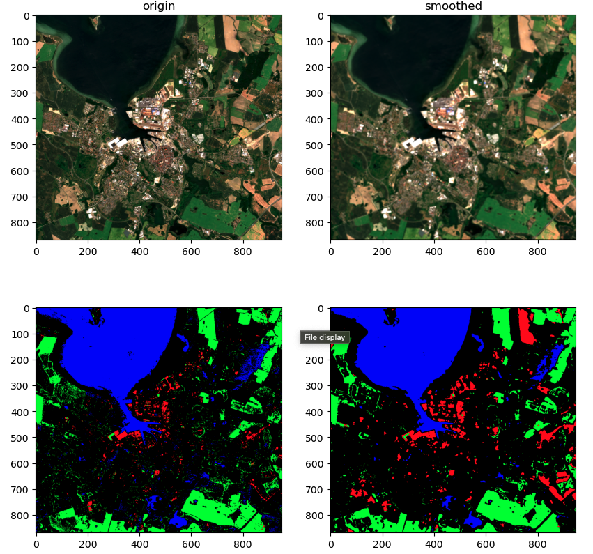

[🇺🇸 English | English README](./README.md)

# 遥感图像处理课程项目


## 📚 内容
1. **遥感基础：** 关键概念，Sentinel-2数据下载、结构理解与波段可视化。
2. **图像增强与滤波：** 增强方法、二维卷积、直方图分析与解读。
3. **边缘检测与分类：** 边缘检测方法、土地覆盖制图与分类技术。
4. **植被指数与高光谱像元分类：** 植被指数应用与高光谱分析。
5. **遥感中的卷积神经网络（CNN）：** 深度学习（如ResNet18）在图像与高光谱分类中的应用。
6. **深度表征学习：** 用于遥感图像检索的深度学习方法。
7. **高光谱图像处理：** 高级高光谱数据分析与实验。

## 🧪 实验与作业

### HW01：Sentinel-2数据与可视化
- **目标：** 下载并可视化Sentinel-2卫星数据，理解数据结构，编程访问特定波段。
- **技能点：** 数据获取、波段提取、可视化、SAFE格式分析。

### HW02：ResNet18多标签场景分类
- **目标：** 基于ResNet18实现遥感图像的多标签监督分类，探索多种数据增强方法。
- **技能点：** 深度学习、PyTorch、数据增强、多标签评估。

### Lab01-07：专题实验
- **Lab01：** Sentinel-2基础，Copernicus数据访问，波段可视化。
- **Lab02-03：** 图像增强、滤波与边缘检测。
- **Lab04-05：** 土地覆盖分类、植被指数、像元级分析。
- **Lab06：** 遥感深度学习，卷积神经网络。
- **Lab07：** 高光谱图像处理与高级分类。

<div align="center">
  
</div>

---

## 🛠️ 环境导出
导出环境命令：
```conda env export > environment.yml``` 